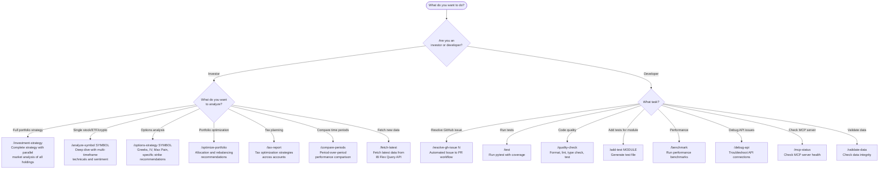

# .claude/ Directory - Advanced Development Automation

This directory powers **Mode 3** of IB Analytics: **Development Automation** with AI-powered workflows.

## 🎯 What You Get with Mode 3

**For Investors & Analysts**:

- ⚡ **95% faster investment strategy generation** (6-8 hours → 15-20 minutes)
- 📊 **Parallel market analysis** of all holdings simultaneously
- 🎯 **Consolidated multi-account view** with accurate portfolio metrics
- 📈 **Professional-grade options strategies** with specific strikes and Greeks
- 💰 **Tax-optimized execution plans** across multiple accounts

**For Developers**:

- 🤖 **90% faster issue resolution** (80 minutes → 8 minutes)
- ✅ **Automated quality gates** (black, ruff, mypy, pytest)
- 🔄 **Complete TDD workflow** (tests → code → PR)
- 📝 **Auto-generated PR descriptions** with comprehensive context
- 🔧 **11 specialized AI agents** for different domains

**Time Savings Summary**:
| Task | Manual | Automated | Savings |
|------|--------|-----------|---------|
| Investment Strategy | 6-8 hours | 15-20 min | **95%** |
| Stock Analysis | 1-2 hours | 2-3 min | **97%** |
| Options Strategy | 45-60 min | 3-5 min | **93%** |
| Portfolio Analysis | 3-4 hours | 5 min | **95%** |
| GitHub Issue → PR | 80 min | 8 min | **90%** |
| Quality Checks | 15 min | 2 min | **87%** |

## 📁 Directory Structure

```
.claude/
├── CLAUDE.md              # Main project context (auto-loaded)
├── README.md              # This file
├── settings.local.json    # Local settings (gitignored)
├── agents/                # Specialized sub-agents (11 agents)
│   ├── test-runner.md
│   ├── data-analyzer.md
│   ├── tax-optimizer.md       # NEW: Tax optimization specialist
│   ├── api-debugger.md
│   ├── code-reviewer.md
│   ├── performance-optimizer.md
│   ├── issue-analyzer.md
│   ├── code-implementer.md
│   ├── market-analyst.md
│   ├── strategy-coordinator.md
│   └── portfolio-risk-analyst.md  # NEW: Portfolio risk analysis
└── commands/              # Custom slash commands (20 commands)
    ├── fetch-latest.md
    ├── debug-api.md
    ├── test.md
    ├── quality-check.md
    ├── optimize-portfolio.md
    ├── compare-periods.md
    ├── tax-report.md
    ├── add-test.md
    ├── benchmark.md
    ├── validate-data.md
    ├── mcp-status.md
    ├── rebalance-portfolio.md # Portfolio rebalancing with target profiles
    ├── resolve-gh-issue.md
    ├── dividend-analysis.md   # Dividend income & IE ETF tax efficiency
    ├── sector-analysis.md     # Sector allocation & HHI concentration
    ├── wash-sale-check.md     # Wash sale detection & tax loss harvesting
    ├── fx-exposure.md         # Currency exposure & FX risk simulation
    ├── analyze-symbol.md      # Comprehensive symbol analysis
    ├── investment-strategy.md # Investment strategy planning
    └── options-strategy.md    # Options strategy analysis
```

## 🤖 Sub-Agents (Specialized AI Experts)

Specialized AI assistants that handle specific tasks in their own context window, keeping the main conversation focused.

### Available Sub-Agents (11 Total)

#### 📊 **Investment Analysis Agents** (NEW!)

##### **strategy-coordinator** 🎯

**Purpose**: Investment strategy orchestration and synthesis
**When to use**: Comprehensive investment planning, multi-account optimization
**Key Features**:

- **Parallel market analysis**: Analyzes 5-10 stocks simultaneously (80-90% time reduction)
- **Multi-agent coordination**: Delegates to data-analyzer + market-analyst
- **Consolidated portfolio view**: True portfolio-level analysis across ALL accounts
- **Actionable priorities**: Urgent → High → Medium → Monitoring
  **Time Savings**: 6-8 hours → 15-20 minutes (95% reduction)

##### **market-analyst** 📈

**Purpose**: Stock and options market specialist
**When to use**: Technical analysis, options strategies, entry/exit timing
**Tools**: All Yahoo Finance MCP tools, technical indicators, Greeks calculations
**Key Features**:

- Multi-timeframe analysis (daily/weekly/monthly confluence)
- Support/resistance levels with entry/exit signals
- Options Greeks, IV Rank/Percentile, Max Pain
- News sentiment and catalysts
- **Buy/Sell/Hold ratings** with conviction (1-10)
  **Time Savings**:
- Stock analysis: 1-2 hours → 2-3 minutes (97% reduction)
- Options strategy: 45-60 minutes → 3-5 minutes (93% reduction)

##### **data-analyzer** 📊

**Purpose**: Financial data analysis specialist for IB trading data
**When to use**: Deep portfolio analysis, performance metrics, portfolio reviews
**Tools**: All MCP analysis tools, Python, Read
**Key Features**:

- **Consolidated multi-account analysis** (accurate portfolio-level metrics)
- Performance, cost, risk, bond analytics
- Time-series position tracking
- For deep tax optimization, delegates to `tax-optimizer`
  **Auto-activates**: On portfolio/analysis queries
  **Time Savings**: 3-4 hours → 5 minutes (95% reduction)

##### **tax-optimizer** 💰

**Purpose**: Tax optimization specialist for Malaysian tax residents
**When to use**: Wash sale analysis, OID/phantom income, Ireland ETF advantages, tax-loss harvesting
**Tools**: analyze_tax, calculate_tax_loss_harvesting, analyze_dividend_income, compare_periods
**Key Features**:

- Malaysia tax regime expertise (capital gains exemption, WHT optimization)
- Wash sale 30-day window analysis
- OID/phantom income calculations for zero-coupon bonds
- Ireland-domiciled ETF restructuring recommendations (15% vs 30% WHT)
- Tax-loss harvesting with alternative securities

#### 💻 **Development Agents**

##### **test-runner** 🧪

**Purpose**: Testing specialist for pytest, coverage, and quality assurance
**When to use**: After code changes, before commits, for coverage analysis
**Tools**: pytest, pytest-cov, Read, Write, Grep
**Auto-activates**: On test-related queries

##### **code-implementer** 💻

**Purpose**: Python implementation specialist with financial software expertise
**When to use**: Implementing features, writing analyzers, TDD development
**Tools**: Edit, MultiEdit, Write, Read, WebSearch, TodoWrite, Python tools
**Model**: opus (for complex implementations)
**Key Features**:

- Follows existing codebase patterns
- Enforces Decimal precision for financial calculations
- Implements Pydantic v2 models correctly
- Writes comprehensive docstrings
- Test-Driven Development (TDD) workflow
- WebSearch for best practices research
  **Auto-activates**: Via `/resolve-gh-issue` command

##### **code-reviewer** 📝

**Purpose**: Code quality and standards enforcement
**When to use**: Before commits, PR reviews, quality checks
**Tools**: black, ruff, mypy, Read, Grep
**Auto-activates**: PROACTIVE before commits
**Time Savings**: 15 minutes → 2 minutes (87% reduction)

##### **performance-optimizer** ⚡

**Purpose**: Performance analysis and optimization
**When to use**: Profiling, benchmarking, bottleneck identification
**Tools**: cProfile, timeit, tracemalloc, Read
**Auto-activates**: On performance queries

##### **api-debugger** 🔧

**Purpose**: IB Flex Query API troubleshooting specialist
**When to use**: API connectivity issues, credential validation, debugging
**Tools**: curl, Python, grep, MCP fetch tools
**Auto-activates**: On API error queries

##### **issue-analyzer** 🔍

**Purpose**: GitHub issue analysis and requirement extraction
**When to use**: Analyzing GitHub issues, extracting acceptance criteria, planning implementation
**Tools**: gh CLI, Read, WebSearch, TodoWrite, Grep
**Model**: opus (for high precision)
**Key Features**:

- Extracts structured requirements from GitHub issues
- Identifies acceptance criteria and technical scope
- Flags financial code requirements (Decimal precision, etc.)
- Generates implementation checklists
- Never hallucinates - always uses actual GitHub data
  **Auto-activates**: Via `/resolve-gh-issue` command
  **Time Savings**: 20 minutes analysis → 3 minutes (85% reduction)

#### ⚠️ **Risk Analysis Agents** (NEW!)

##### **portfolio-risk-analyst** ⚠️

**Purpose**: Portfolio risk analysis specialist for investment risk assessment
**When to use**: Concentration risk, correlation analysis, VaR, interest rate sensitivity, diversification review
**Tools**: `analyze_risk`, `analyze_portfolio_correlation`, `get_position_statistics`, `calculate_portfolio_metrics`, `analyze_sector_allocation`, `analyze_fx_exposure`
**Key Features**:

- **Concentration risk**: Sector, currency, and geographic exposure
- **Correlation analysis**: Portfolio diversification effectiveness
- **VaR calculation**: Parametric and historical Value at Risk
- **Interest rate sensitivity**: Duration, convexity, rate scenario analysis
- **Risk-adjusted metrics**: Sharpe ratio, Sortino ratio, max drawdown
- **Clear distinction from `performance-optimizer`**: This is investment risk, not code performance
  **Auto-activates**: On portfolio risk, VaR, concentration risk, diversification queries

### How Sub-Agents Work

**Automatic Delegation**:

```
You: "Run tests with coverage"
Claude: [Delegates to test-runner sub-agent]
test-runner: [Executes pytest in isolated context]
test-runner: [Returns results to main thread]
Claude: [Presents formatted results]
```

**Explicit Invocation**:

```
You: "Use the data-analyzer subagent to analyze my portfolio"
Claude: [Explicitly delegates to data-analyzer]
```

**Benefits**:

- ✅ **Context Isolation**: Each sub-agent has dedicated context window
- ✅ **Specialization**: Expert knowledge for specific domains
- ✅ **Parallel Work**: Multiple sub-agents can work simultaneously
- ✅ **Clean Main Thread**: Main conversation stays focused on high-level tasks

## 📋 Slash Commands (Automated Workflows)

Pre-configured prompts for common operations. Type `/` in Claude Code to see all available commands.

### 📊 Investment Analysis Commands (NEW!)

#### `/investment-strategy [--save]`

**Master command** for comprehensive investment planning
Delegates to: **strategy-coordinator** → **data-analyzer** + **market-analyst** (parallel)

**What it does**:

- **Consolidated portfolio analysis** across ALL accounts (not per-account)
- **Parallel market analysis** of all holdings (5-10 stocks simultaneously)
- **2-year chart context** for every position with entry/exit scenarios
- **Options strategies** with specific strikes, premiums, Greeks
- **Tax-optimized execution** plans per account
- **Actionable priorities**: Urgent (this week) → High (this month) → Medium (this quarter)

**Performance Optimization**:

- **Parallel sub-agent execution**: 80-90% time reduction
- Sequential: N stocks × 2 min = 10-20 min
- Parallel: max(2 min) = 2 min

**Time Savings**: 6-8 hours manual research → **15-20 minutes** (95% reduction)

```bash
/investment-strategy         # Generate comprehensive strategy
/investment-strategy --save  # Save to data/processed/
```

#### `/analyze-symbol SYMBOL`

Comprehensive symbol analysis with technical, fundamental, and options (stocks, ETFs, crypto, forex)
Delegates to: **market-analyst** sub-agent

**What it does**:

- Multi-timeframe technical analysis (daily/weekly/monthly)
- Support/resistance levels with entry/exit signals
- Options market analysis (IV Rank, Greeks, Max Pain) - when available
- News sentiment and catalysts
- **Buy/Sell/Hold rating** with conviction level (1-10)

**Time Savings**: 1-2 hours research → **2-3 minutes** (97% reduction)

```bash
/analyze-symbol AAPL          # Stock
/analyze-symbol VOO           # ETF
/analyze-symbol BTC-USD       # Crypto
/analyze-symbol USDJPY=X      # Forex
```

#### `/options-strategy SYMBOL`

Detailed options strategy analysis
Delegates to: **market-analyst** sub-agent

**What it does**:

- IV environment assessment (buy vs sell premium)
- Greeks analysis with risk assessment
- 2-3 specific strategy recommendations with exact strikes
- Max profit/loss, breakeven, probability of profit
- Risk/reward comparison with best strategy selection

**Time Savings**: 45-60 minutes → **3-5 minutes** (93% reduction)

```bash
/options-strategy AAPL
/options-strategy SPY
```

### 📈 Portfolio Analysis Commands

#### `/optimize-portfolio [csv-file-path]`

Comprehensive portfolio analysis with recommendations
Delegates to: **data-analyzer** sub-agent

**Time Savings**: 3-4 hours → **5 minutes** (95% reduction)

```bash
/optimize-portfolio                              # Use latest CSV
/optimize-portfolio data/raw/U1234567_*.csv    # Specific file
```

#### `/compare-periods period1-start period1-end period2-start period2-end`

Compare performance across two time periods
Delegates to: **data-analyzer** sub-agent

```bash
/compare-periods 2025-01-01 2025-03-31 2025-04-01 2025-06-30
/compare-periods --ytd          # Compare YTD vs previous YTD
/compare-periods --quarter      # Current vs previous quarter
```

#### `/tax-report [--year YYYY|--ytd|--save]`

Generate comprehensive tax analysis report
Delegates to: **tax-optimizer** + **market-analyst** sub-agents

```bash
/tax-report                # Current year
/tax-report --year 2024    # Specific year
/tax-report --save         # Save to file
```

#### `/dividend-analysis [--start YYYY-MM-DD] [--account N]`

Analyze dividend income and Ireland-domiciled ETF tax efficiency comparison
Uses: `analyze_dividend_income` MCP tool

```bash
/dividend-analysis                    # Default period
/dividend-analysis --start 2024-01-01 # Custom start date
/dividend-analysis --account 1        # Second account
```

#### `/sector-analysis [--start YYYY-MM-DD] [--account N]`

Analyze sector allocation and concentration risk (HHI)
Uses: `analyze_sector_allocation` MCP tool

```bash
/sector-analysis                      # Default period
/sector-analysis --start 2024-01-01   # Custom start date
/sector-analysis --account 1          # Second account
```

#### `/wash-sale-check [--start YYYY-MM-DD] [--tax-rate 0.30] [--account N]`

Detect wash sale violations and tax loss harvesting opportunities
Uses: `calculate_tax_loss_harvesting` MCP tool

```bash
/wash-sale-check                      # Default (30% tax rate)
/wash-sale-check --tax-rate 0.20      # Custom tax rate
/wash-sale-check --start 2024-01-01   # Custom start date
```

#### `/fx-exposure [--start YYYY-MM-DD] [--scenario-pct 10] [--account N]`

Analyze currency exposure and FX risk with scenario simulation
Uses: `analyze_fx_exposure` MCP tool

```bash
/fx-exposure                          # Default +/-10% scenario
/fx-exposure --scenario-pct 15        # Custom +/-15% scenario
/fx-exposure --account 1              # Second account
```

#### `/rebalance-portfolio [--profile balanced|growth|conservative|income] [--dry-run]`

Calculate rebalancing trades to align portfolio with target allocation profiles
Uses: `generate_rebalancing_trades` and `simulate_rebalancing` MCP tools

**What it does**:

- Compares current portfolio allocation against target asset-class weights
- Generates specific buy/sell trades with estimated shares and commissions
- Supports 4 investment profiles (balanced, growth, conservative, income)
- `--dry-run` mode shows tax impact and cost analysis without generating trades

```bash
/rebalance-portfolio                            # Default balanced profile
/rebalance-portfolio --profile growth           # Growth-focused allocation
/rebalance-portfolio --profile conservative --dry-run  # Preview with tax impact
```

### 🔧 Development Commands

#### `/test [--coverage|--verbose|--failed|pattern]`

Run pytest test suite with coverage reporting
Delegates to: **test-runner** sub-agent

```bash
/test                  # Full test suite with coverage
/test --verbose        # Verbose output
/test --coverage       # Quick coverage check
/test --failed         # Re-run failed tests only
/test performance      # Run tests matching "performance"
```

#### `/quality-check [--fix|--strict]`

Run full quality gate: format, lint, type, test
Delegates to: **code-reviewer** sub-agent

```bash
/quality-check         # Check all quality gates
/quality-check --fix   # Auto-fix issues
/quality-check --strict # Strict mode for CI/CD
```

#### `/add-test module-name [--analyzer|--parser|--model]`

Create comprehensive test file for module
Delegates to: **test-runner** sub-agent

```bash
/add-test performance --analyzer
/add-test csv_parser --parser
/add-test Trade --model
```

#### `/benchmark [--full|--quick|module-name]`

Performance benchmarking and profiling
Delegates to: **performance-optimizer** sub-agent

```bash
/benchmark             # Quick benchmark
/benchmark --full      # Full benchmark suite
/benchmark bond        # Benchmark specific module
```

### Analysis Commands

#### `/optimize-portfolio [csv-file-path]`

Comprehensive portfolio analysis with recommendations
Delegates to: **data-analyzer** sub-agent

```bash
/optimize-portfolio                              # Use latest CSV
/optimize-portfolio data/raw/U1234567_*.csv    # Specific file
```

#### `/compare-periods period1-start period1-end period2-start period2-end`

Compare performance across two time periods
Delegates to: **data-analyzer** sub-agent

```bash
/compare-periods 2025-01-01 2025-03-31 2025-04-01 2025-06-30
/compare-periods --ytd          # Compare YTD vs previous YTD
/compare-periods --quarter      # Current vs previous quarter
/compare-periods --month        # Current vs previous month
```

#### `/tax-report [--year YYYY|--ytd|--save]`

Generate comprehensive tax analysis report
Delegates to: **tax-optimizer** + **market-analyst** sub-agents

```bash
/tax-report                # Current year
/tax-report --year 2024    # Specific year
/tax-report --ytd          # Year-to-date
/tax-report --save         # Save to file
```

#### `/validate-data [csv-file-path|--latest]`

Data integrity and format validation

```bash
/validate-data                        # Validate all CSVs
/validate-data --latest              # Latest file only
/validate-data data/raw/file.csv     # Specific file
```

### Utility Commands

#### `/mcp-status [--verbose|--test]`

Check MCP server health and tool availability

```bash
/mcp-status            # Basic health check
/mcp-status --verbose  # Detailed output
/mcp-status --test     # Run functionality tests
```

#### `/debug-api [--verbose|--test-credentials]`

Troubleshoot IB API connectivity
Delegates to: **api-debugger** sub-agent

```bash
/debug-api                    # Full diagnostic
/debug-api --verbose          # Detailed output
/debug-api --test-credentials # Test credentials only
```

### GitHub Workflow Commands (NEW!)

#### `/resolve-gh-issue issue-number [--skip-checks|--skip-tests|--dry-run]`

Complete GitHub issue resolution workflow with TDD
Orchestrates: **issue-analyzer**, **test-runner**, **code-implementer**, **code-reviewer** sub-agents

```bash
/resolve-gh-issue 42                   # Full workflow for issue #42
/resolve-gh-issue 42 --dry-run         # Show plan without executing
/resolve-gh-issue 42 --skip-checks     # Skip quality checks (not recommended)
/resolve-gh-issue 42 --skip-tests      # Create tests but don't run
```

**Complete 10-Phase Workflow**:

1. **Issue Analysis** - Extract requirements from GitHub issue (issue-analyzer)
2. **Planning** - Create task breakdown and branch (TodoWrite + git)
3. **Test Creation** - Write failing tests first (TDD via test-runner)
4. **Implementation** - Implement solution (code-implementer)
5. **Quality Assurance** - Run all quality checks (code-reviewer)
6. **Documentation** - Update docstrings and CHANGELOG
7. **Commit** - Create structured commit with issue reference
8. **Pull Request** - Generate PR with comprehensive description
9. **CI Monitoring** - Watch CI checks for failures
10. **Issue Closure** - Automatic closure when PR merges

**Quality Gates**:

- ✅ All acceptance criteria met
- ✅ Tests created and passing (≥80% coverage)
- ✅ Black formatting applied
- ✅ Ruff linting passed
- ✅ Mypy type checking strict mode
- ✅ Financial code validation (Decimal precision)
- ✅ Documentation complete

**Example Output**:

```
[1/10] Analyzing Issue #42...
✓ Requirements extracted
✓ Acceptance criteria: 4 items
✓ Financial code: YES (Decimal required)

[2/10] Creating task breakdown...
✓ 6 tasks created in TodoList

[3/10] Creating tests (TDD)...
✓ Test file: tests/test_analyzers/test_performance_sharpe.py
✓ 8 tests created (failing as expected)

[4/10] Implementing solution...
✓ Method: calculate_sharpe_ratio() implemented
✓ All tests passing: 8/8 ✓

[5/10] Running quality checks...
✓ black, ruff, mypy all passed

[6/10] Creating PR #123...
✓ URL: https://github.com/user/repo/pull/123

✅ Issue #42 resolved successfully!
```

### Legacy Commands

This command is still available for manual data fetching:

- `/fetch-latest [--multi-account|--start-date|--end-date]` - Fetch IB data manually

**Note**: For new features, use `/resolve-gh-issue` which provides a complete workflow from issue to PR.

## 🏗️ Architecture Overview

### System Architecture

The IB Analytics project follows a modular, layered architecture optimized for financial data processing:

```
┌─────────────────────────────────────────────────────────────────┐
│                        CLI Layer                                │
│  (ib-sec-fetch, ib-sec-analyze, ib-sec-report)                 │
└──────────────────────────┬──────────────────────────────────────┘
                           │
┌──────────────────────────▼──────────────────────────────────────┐
│                     MCP Server Layer                            │
│  (FastMCP - Model Context Protocol for Claude Desktop)         │
│  • 7 Tools (fetch, analyze_*, get_portfolio_summary)           │
│  • 6 Resources (portfolio URIs, account data)                  │
│  • 5 Prompts (analysis templates)                              │
└──────────────────────────┬──────────────────────────────────────┘
                           │
┌──────────────────────────▼──────────────────────────────────────┐
│                   Core Analysis Layer                           │
│  ┌──────────────┐  ┌──────────────┐  ┌──────────────┐         │
│  │  Analyzers   │  │  Aggregator  │  │  Calculator  │         │
│  │ • Performance│  │ • Multi-acct │  │ • YTM        │         │
│  │ • Cost       │  │ • Rollup     │  │ • Duration   │         │
│  │ • Bond       │  │ • Reporting  │  │ • Tax        │         │
│  │ • Tax        │  └──────────────┘  └──────────────┘         │
│  │ • Risk       │                                              │
│  └──────────────┘                                              │
└──────────────────────────┬──────────────────────────────────────┘
                           │
┌──────────────────────────▼──────────────────────────────────────┐
│                     Data Layer                                  │
│  ┌──────────────┐  ┌──────────────┐  ┌──────────────┐         │
│  │  Parsers     │  │  Models      │  │  API Client  │         │
│  │ • CSV        │  │ • Trade      │  │ • FlexQuery  │         │
│  │ • XML        │  │ • Position   │  │ • Async      │         │
│  │ • Multi-sect │  │ • Account    │  │ • Retry      │         │
│  └──────────────┘  │ • Portfolio  │  └──────────────┘         │
│                    │ (Pydantic v2)│                            │
│                    └──────────────┘                            │
└──────────────────────────┬──────────────────────────────────────┘
                           │
┌──────────────────────────▼──────────────────────────────────────┐
│                  External Services                              │
│  • IB Flex Query API (Interactive Brokers)                     │
│  • GitHub API (via gh CLI)                                     │
└─────────────────────────────────────────────────────────────────┘
```

### Data Flow

1. **Data Ingestion**: Flex Query API → CSV Parser → Pydantic Models
2. **Analysis**: Models → Analyzers → AnalysisResult
3. **Reporting**: AnalysisResult → Report Renderer → Console/File
4. **Integration**: MCP Server → Claude Desktop → User Interaction

### Key Design Principles

- **Type Safety**: Pydantic v2 models with strict validation
- **Financial Accuracy**: Decimal precision throughout (never float)
- **Modularity**: Pluggable analyzers and reports
- **Async Support**: Async API client for multi-account operations
- **Error Handling**: Custom exceptions with detailed context

### Claude Code Integration

```
User Query → Claude Code → MCP Server → IB Analytics Library → Results
     │                          │
     └──────────────────────────┴→ Sub-Agents:
                                   • issue-analyzer (GitHub)
                                   • code-implementer (TDD)
                                   • test-runner (pytest)
                                   • code-reviewer (quality)
                                   • data-analyzer (portfolio)
                                   • api-debugger (diagnostics)
                                   • performance-optimizer (profiling)
```

## 🚀 Quick Start Guide

### 1. First-Time Setup

```bash
# Verify MCP server
/mcp-status

# Fetch latest data
/fetch-latest

# Run quality check
/quality-check
```

### 2. Daily Development Workflow

```bash
# Before coding
/quality-check              # Ensure clean baseline

# During coding
# [Make changes]

# Before commit
/quality-check --fix        # Auto-fix issues
/test                       # Run tests
```

### 3. Portfolio Analysis Workflow

```bash
# Get latest data
/fetch-latest

# Validate data
/validate-data --latest

# Comprehensive analysis
/optimize-portfolio

# Tax planning
/tax-report --save
```

### 4. Performance Optimization Workflow

```bash
# Benchmark current state
/benchmark --full

# Profile specific module
/benchmark bond

# [Make optimizations]

# Verify improvements
/benchmark --full
```

## 📚 Best Practices

### Using Sub-Agents

**When to delegate to sub-agents**:

- ✅ Complex, specialized tasks (testing, profiling, analysis)
- ✅ Tasks requiring isolated context (prevent main thread pollution)
- ✅ Repetitive workflows that benefit from expertise

**When NOT to delegate**:

- ❌ Simple one-off tasks
- ❌ Tasks requiring main context awareness
- ❌ Quick questions or clarifications

### Using Slash Commands

**Create new commands when**:

- ✅ Repeating the same workflow 3+ times
- ✅ Task has consistent structure and arguments
- ✅ Team members would benefit from standardization

**Don't create commands for**:

- ❌ One-time operations
- ❌ Highly variable workflows
- ❌ Tasks that need human judgment

### Context Management

**Project Context** (`.claude/CLAUDE.md`):

- Project-specific conventions
- Architecture decisions
- Common workflows
- Team standards

**User Context** (`~/.claude/CLAUDE.md`):

- Personal preferences
- Global coding style
- Cross-project patterns

**Sub-Agent Context** (`.claude/agents/*.md`):

- Specialized knowledge
- Domain expertise
- Tool configurations

## 🔧 Maintenance

### Regular Updates

**Weekly**:

- Review sub-agent performance
- Update command arguments if needed

**Monthly**:

- Review CLAUDE.md for accuracy
- Add new commands for emerging patterns
- Archive unused commands

**After Major Changes**:

- Update CLAUDE.md with new conventions
- Add commands for new workflows
- Update sub-agent tools/permissions

### Quality Checks

```bash
# Verify all commands work
/mcp-status

# Test sub-agents
/test --verbose
/quality-check
/benchmark --quick

# Validate data pipeline
/validate-data --latest
```

## 📖 Additional Resources

### Documentation

- [Claude Code Best Practices](https://www.anthropic.com/engineering/claude-code-best-practices)
- [Sub-Agents Guide](https://docs.claude.com/en/docs/claude-code/sub-agents)
- [Slash Commands Guide](https://docs.claude.com/en/docs/claude-code/slash-commands)

### Examples

- See `WORKFLOWS.md` for complete workflow examples
- Check individual command files for usage examples
- Review sub-agent files for specialization details

---

## 📚 Additional Resources

### Documentation

- [Main README](../README.md): User documentation and 3 usage modes
- [Project CLAUDE.md](../CLAUDE.md): General development guide
- [.claude/CLAUDE.md](CLAUDE.md): Claude Code extensions
- [SUB_AGENTS.md](SUB_AGENTS.md): Detailed sub-agent development guide
- [SLASH_COMMANDS.md](SLASH_COMMANDS.md): Detailed slash command development guide

### Quick Links

- [Claude Code Best Practices](https://www.anthropic.com/engineering/claude-code-best-practices)
- [Sub-Agents Guide](https://docs.claude.com/en/docs/claude-code/sub-agents)
- [Slash Commands Guide](https://docs.claude.com/en/docs/claude-code/slash-commands)

---

## 🎯 Quick Start Examples

### For Investors

**Comprehensive Investment Strategy** (95% time savings):

```bash
/investment-strategy --save
# Analyzes ALL accounts + holdings in parallel → 15-20 minutes
# Manual equivalent: 6-8 hours of research
```

**Individual Symbol Analysis** (97% time savings):

```bash
/analyze-symbol PG
# Multi-timeframe technicals + options + news → 2-3 minutes
# Manual equivalent: 1-2 hours of research
```

**Options Strategy** (93% time savings):

```bash
/options-strategy SPY
# IV environment + Greeks + strategies → 3-5 minutes
# Manual equivalent: 45-60 minutes
```

### For Developers

**GitHub Issue Resolution** (90% time savings):

```bash
/resolve-gh-issue 42
# Issue → Tests → Code → Quality → PR → 8 minutes
# Manual equivalent: 80 minutes
```

**Quality Check** (87% time savings):

```bash
/quality-check --fix
# black + ruff + mypy + pytest → 2 minutes
# Manual equivalent: 15 minutes
```

---

## 🗺️ Command Selection Guide

Use this guide to find the right command for your task.

### Decision Flowchart



### Investment Analysis Commands

| Command                    | Description                                                         | Time Savings         | Example                                                        |
| -------------------------- | ------------------------------------------------------------------- | -------------------- | -------------------------------------------------------------- |
| `/investment-strategy`     | Complete investment strategy with all holdings analyzed in parallel | 6-8 hrs to 15-20 min | `/investment-strategy`                                         |
| `/analyze-symbol SYMBOL`   | Deep dive into a single stock, ETF, crypto, or forex pair           | 1-2 hrs to 2-3 min   | `/analyze-symbol AAPL`                                         |
| `/options-strategy SYMBOL` | Options analysis with Greeks, IV, Max Pain, specific strikes        | 45-60 min to 3-5 min | `/options-strategy SPY`                                        |
| `/optimize-portfolio`      | Portfolio-level optimization recommendations                        | 3-4 hrs to 5 min     | `/optimize-portfolio`                                          |
| `/tax-report`              | Tax planning and optimization strategies                            | 2-3 hrs to 5 min     | `/tax-report --save`                                           |
| `/compare-periods`         | Compare performance across two time periods                         | 1-2 hrs to 5 min     | `/compare-periods 2025-01-01 2025-03-31 2025-04-01 2025-06-30` |

### Data and Utility Commands

| Command          | Description                                      | Use Case                                |
| ---------------- | ------------------------------------------------ | --------------------------------------- |
| `/fetch-latest`  | Fetch latest trading data from IB Flex Query API | Before running analysis with fresh data |
| `/validate-data` | Validate data integrity and format               | After fetching data or troubleshooting  |
| `/debug-api`     | Troubleshoot API connection issues               | When API calls fail                     |
| `/mcp-status`    | Check MCP server health                          | When tools are not responding           |

### Development Commands

| Command               | Description                                       | Use Case                |
| --------------------- | ------------------------------------------------- | ----------------------- |
| `/resolve-gh-issue N` | Automated issue-to-PR workflow (90% time savings) | Resolving GitHub issues |
| `/quality-check`      | Run format, lint, type, and test checks           | Before committing code  |
| `/test`               | Run pytest with coverage report                   | Testing changes         |
| `/add-test MODULE`    | Generate comprehensive test file for a module     | Adding test coverage    |
| `/benchmark`          | Run performance benchmarks                        | Optimizing performance  |

---

**Last Updated**: 2025-10-16
**Maintained By**: Development Team

**New in this version (v3.0)** - Investment Analysis Automation:

- ✨ **3 new investment agents**: strategy-coordinator, market-analyst, data-analyzer
- 📊 **Parallel market analysis**: 80-90% time reduction for multi-stock analysis
- 🎯 **Consolidated multi-account view**: True portfolio-level metrics
- 📈 **3 new slash commands**: /investment-strategy, /analyze-symbol, /options-strategy
- 💰 **Professional options analysis**: Greeks, IV metrics, Max Pain, specific strategies
- 📉 **Multi-timeframe technical analysis**: Daily/weekly/monthly confluence
- 🔄 **2-year chart context**: For every position with entry/exit scenarios
- 🏗️ **Time savings documentation**: 95-97% reduction for investment workflows

**Version v2.1** (Previous):

- 7 specialized sub-agents (issue-analyzer, code-implementer added)
- 12 slash commands (removed 3 obsolete, added /resolve-gh-issue)
- Complete Test-Driven Development (TDD) workflow
- GitHub integration: issue → branch → tests → code → PR → CI

**Version v2.0**:

- 7 sub-agents, 15 slash commands
- Initial GitHub workflow integration

**Version v1.0**:

- 5 sub-agents, 14 slash commands
- Basic portfolio analysis tools
