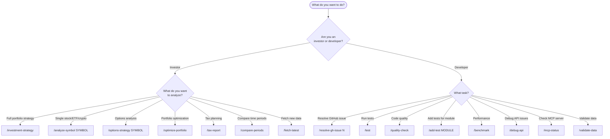

# .claude/ — Mode 3 Feature Catalog

This directory powers **Mode 3** of IB Analytics: **AI-powered development and investment automation**.

- **11 specialized sub-agents** for domain-specific tasks
- **21 slash commands** for automated workflows
- Details: each `.claude/agents/*.md` and `.claude/commands/*.md` file

---

## Sub-Agents (11)

Specialized AI assistants that run in isolated context windows.

| Agent                      | Purpose                                                         | Auto-activates          | Model  |
| -------------------------- | --------------------------------------------------------------- | ----------------------- | ------ |
| **strategy-coordinator**   | Investment strategy orchestration, multi-agent coordination     | No                      | sonnet |
| **market-analyst**         | Stock/options technical analysis, entry/exit timing, Greeks     | No                      | sonnet |
| **data-analyzer**          | Portfolio analysis, performance metrics, multi-account          | On analysis queries     | sonnet |
| **tax-optimizer**          | Malaysia tax optimization, wash sales, OID, Ireland ETFs        | No                      | sonnet |
| **portfolio-risk-analyst** | Concentration risk, VaR, correlation, interest rate sensitivity | On risk queries         | sonnet |
| **test-runner**            | pytest, coverage, test creation                                 | On test queries         | sonnet |
| **code-implementer**       | Feature implementation with TDD                                 | Via `/resolve-gh-issue` | opus   |
| **code-reviewer**          | Code quality (black, ruff, mypy) enforcement                    | Before commits          | sonnet |
| **performance-optimizer**  | Code profiling, benchmarking, bottleneck identification         | On performance queries  | sonnet |
| **api-debugger**           | IB Flex Query API troubleshooting                               | On API errors           | sonnet |
| **issue-analyzer**         | GitHub issue analysis, requirement extraction                   | Via `/resolve-gh-issue` | opus   |

Details: `.claude/agents/{agent-name}.md`

---

## Slash Commands (21)

Type `/` in Claude Code to see all available commands.

### Investment Analysis

| Command                    | Description                                           | Delegates to         |
| -------------------------- | ----------------------------------------------------- | -------------------- |
| `/investment-strategy`     | Comprehensive strategy with parallel market analysis  | strategy-coordinator |
| `/analyze-symbol SYMBOL`   | Multi-timeframe technicals + options + sentiment      | market-analyst       |
| `/options-strategy SYMBOL` | IV, Greeks, Max Pain, specific strike recommendations | market-analyst       |

### Portfolio Analysis

| Command                | Description                                  | Delegates to  |
| ---------------------- | -------------------------------------------- | ------------- |
| `/optimize-portfolio`  | Portfolio optimization recommendations       | data-analyzer |
| `/compare-periods`     | Period-over-period performance comparison    | data-analyzer |
| `/tax-report`          | Tax optimization across accounts             | tax-optimizer |
| `/dividend-analysis`   | Dividend income & Ireland ETF tax efficiency | MCP tools     |
| `/sector-analysis`     | Sector allocation & HHI concentration risk   | MCP tools     |
| `/wash-sale-check`     | Wash sale detection & tax-loss harvesting    | MCP tools     |
| `/fx-exposure`         | Currency exposure & FX risk simulation       | MCP tools     |
| `/rebalance-portfolio` | Target allocation rebalancing trades         | MCP tools     |

### Monitoring

| Command        | Description                                      | Delegates to |
| -------------- | ------------------------------------------------ | ------------ |
| `/daily-check` | Automated daily portfolio monitoring (scheduled) | MCP tools    |

### Development

| Command               | Description                                      | Delegates to                                                    |
| --------------------- | ------------------------------------------------ | --------------------------------------------------------------- |
| `/resolve-gh-issue N` | Issue-to-PR workflow with TDD (90% time savings) | issue-analyzer + code-implementer + test-runner + code-reviewer |
| `/test`               | pytest with coverage reporting                   | test-runner                                                     |
| `/quality-check`      | Format + lint + type check + test                | code-reviewer                                                   |
| `/add-test MODULE`    | Generate comprehensive test file                 | test-runner                                                     |
| `/benchmark`          | Performance benchmarking                         | performance-optimizer                                           |

### Utility

| Command          | Description                              | Delegates to |
| ---------------- | ---------------------------------------- | ------------ |
| `/fetch-latest`  | Fetch latest data from IB Flex Query API | MCP tools    |
| `/validate-data` | Data integrity validation                | Direct       |
| `/debug-api`     | API connectivity troubleshooting         | api-debugger |
| `/mcp-status`    | MCP server health check                  | Direct       |

Details: `.claude/commands/{command-name}.md`

---

## Command Selection Guide


```mermaid
flowchart TD
    Start([What do you want to do?]) --> Role{Are you an<br/>investor or developer?}

    Role -->|Investor| InvestorGoal{What do you want<br/>to analyze?}
    Role -->|Developer| DevGoal{What task?}

    InvestorGoal -->|Full portfolio strategy| IS["/investment-strategy"]
    InvestorGoal -->|Single stock/ETF/crypto| AS["/analyze-symbol SYMBOL"]
    InvestorGoal -->|Options analysis| OS["/options-strategy SYMBOL"]
    InvestorGoal -->|Portfolio optimization| OP["/optimize-portfolio"]
    InvestorGoal -->|Tax planning| TR["/tax-report"]
    InvestorGoal -->|Compare time periods| CP["/compare-periods"]
    InvestorGoal -->|Fetch new data| FL["/fetch-latest"]

    DevGoal -->|Resolve GitHub issue| RGI["/resolve-gh-issue N"]
    DevGoal -->|Run tests| T["/test"]
    DevGoal -->|Code quality| QC["/quality-check"]
    DevGoal -->|Add tests for module| AT["/add-test MODULE"]
    DevGoal -->|Performance| BM["/benchmark"]
    DevGoal -->|Debug API issues| DA["/debug-api"]
    DevGoal -->|Check MCP server| MS["/mcp-status"]
    DevGoal -->|Validate data| VD["/validate-data"]
```

---

## Quick Start

**Investors**:

```bash
/investment-strategy          # Comprehensive strategy (parallel analysis, 15-20 min)
/analyze-symbol AAPL          # Single symbol deep dive (2-3 min)
```

**Developers**:

```bash
/resolve-gh-issue 42          # Issue → Tests → Code → Quality → PR (8 min)
/quality-check --fix          # black + ruff + mypy + pytest (2 min)
```

---

## Resources

- [Main README](../README.md): User documentation, setup, 3 usage modes
- [CLAUDE.md](../CLAUDE.md): Development guide, mode design, data storage
- [.claude/CLAUDE.md](CLAUDE.md): Claude Code development (agents, commands, settings)
- [SUB_AGENTS.md](SUB_AGENTS.md): Sub-agent development guide
- [SLASH_COMMANDS.md](SLASH_COMMANDS.md): Slash command development guide
