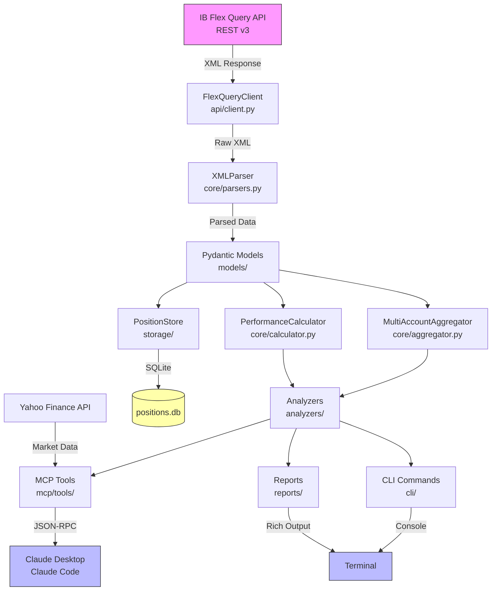
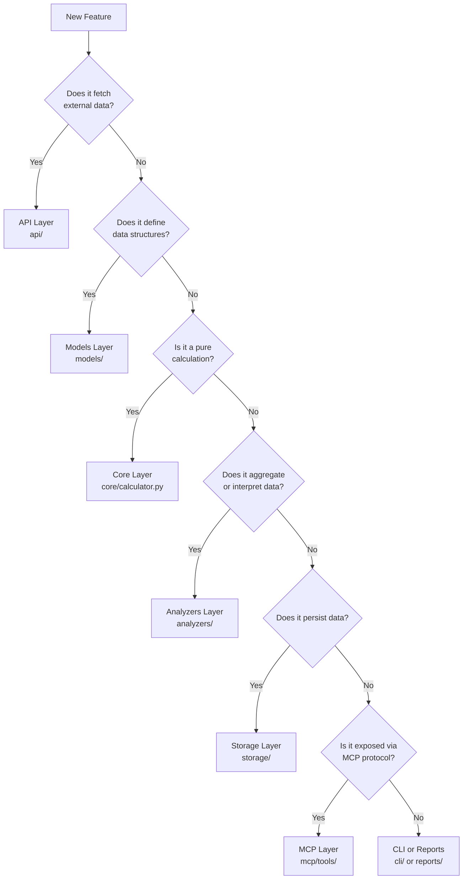

# Architecture

This document describes the IB Analytics architecture, data flow, layer responsibilities, and guidelines for adding new features.

## Data Flow



### Request Lifecycle

1. **Data Acquisition**: `FlexQueryClient` sends a request to IB Flex Query API (two-step: send request, then get statement)
2. **Parsing**: `XMLParser` converts the XML response into structured Python dictionaries
3. **Model Creation**: Pydantic models (`Account`, `Trade`, `Position`) validate and type-check the data
4. **Aggregation**: `MultiAccountAggregator` combines multiple accounts into a `Portfolio`
5. **Analysis**: Specialized `Analyzer` subclasses compute metrics using `PerformanceCalculator`
6. **Presentation**: Results are served via MCP tools (JSON), CLI commands (terminal), or report generators (Rich)

## Layer Responsibilities

```
┌──────────────────────────────────────────┐
│    MCP Layer (FastMCP Server)            │  ← External interface
├──────────────────────────────────────────┤
│    CLI Layer (typer + rich)              │  ← Terminal interface
├──────────────────────────────────────────┤
│    Reports Layer (console/html)          │  ← Output formatting
├──────────────────────────────────────────┤
│    Analyzers Layer (5 analyzers)         │  ← Business logic
├──────────────────────────────────────────┤
│    Core Logic (parser/calculator/agg)    │  ← Data processing
├──────────────────────────────────────────┤
│    Models Layer (Pydantic v2)            │  ← Data validation
├──────────────────────────────────────────┤
│    API Layer (sync + async)              │  ← Data acquisition
├──────────────────────────────────────────┤
│    Storage Layer (SQLite)                │  ← Persistence
└──────────────────────────────────────────┘
```

### API Layer (`ib_sec_mcp/api/`)

| File        | Responsibility                                                                                                                                                 |
| ----------- | -------------------------------------------------------------------------------------------------------------------------------------------------------------- |
| `client.py` | `FlexQueryClient` - Sync and async HTTP requests to IB Flex Query API v3. Two-step fetch (send request → get statement). Retry logic with configurable delays. |
| `models.py` | `APICredentials`, `FlexStatement` - Pydantic models for API request/response validation.                                                                       |

**Design decisions**:

- Uses `httpx` for async support, `requests` for sync fallback
- `defusedxml` for safe XML parsing (prevents XXE attacks)
- Multi-account support via credential list

### Models Layer (`ib_sec_mcp/models/`)

| File           | Responsibility                                                                                    |
| -------------- | ------------------------------------------------------------------------------------------------- |
| `account.py`   | `Account`, `CashBalance` - Account-level data with positions, trades, and cash balances.          |
| `portfolio.py` | `Portfolio` - Multi-account aggregation with `from_accounts()` factory method.                    |
| `position.py`  | `Position` - Open position with bond-specific fields (coupon_rate, maturity_date, ytm, duration). |
| `trade.py`     | `Trade`, `AssetClass`, `BuySell` - Trade records with FIFO P&L, asset class enum.                 |

**Design decisions**:

- All financial values use `Decimal` (never `float`)
- Pydantic v2 for runtime validation and serialization
- `AssetClass` enum: `STK`, `BOND`, `OPT`, `CASH`, `FUND`

### Core Layer (`ib_sec_mcp/core/`)

| File            | Responsibility                                                                                                                                                         |
| --------------- | ---------------------------------------------------------------------------------------------------------------------------------------------------------------------- |
| `parsers.py`    | `XMLParser` - Parses IB Flex Query XML into Account models. Handles date formats, optional fields, and multi-statement files.                                          |
| `calculator.py` | `PerformanceCalculator` - Stateless calculation engine for financial metrics (ROI, CAGR, Sharpe, YTM, duration, phantom income). See [calculators.md](calculators.md). |
| `aggregator.py` | `MultiAccountAggregator` - Aggregates trades/positions across accounts by symbol, asset class, or currency.                                                            |

**Design decisions**:

- Calculator methods are `@staticmethod` for testability and composability
- Parser uses factory pattern: `XMLParser.to_account()` creates validated models
- Aggregator produces `Portfolio` instances for downstream analyzers

### Analyzers Layer (`ib_sec_mcp/analyzers/`)

| File             | Responsibility                                                                                                                                                |
| ---------------- | ------------------------------------------------------------------------------------------------------------------------------------------------------------- |
| `base.py`        | `BaseAnalyzer` (ABC) - Template Method pattern. Provides `analyze()` interface, common accessors (`get_trades()`, `get_positions()`), and `_create_result()`. |
| `performance.py` | `PerformanceAnalyzer` - Win rate, profit factor, ROI, commission analysis.                                                                                    |
| `tax.py`         | `TaxAnalyzer` - Capital gains classification, phantom income (OID) calculation.                                                                               |
| `cost.py`        | `CostAnalyzer` - Commission efficiency, cost breakdown by asset class.                                                                                        |
| `risk.py`        | `RiskAnalyzer` - Interest rate scenarios, duration-based risk.                                                                                                |
| `bond.py`        | `BondAnalyzer` - YTM, duration, price sensitivity for bond positions.                                                                                         |
| `sentiment/`     | Sentiment analysis module for market data.                                                                                                                    |

**Design decisions**:

- Template Method pattern: subclasses implement `analyze()`, base class handles metadata
- Each analyzer accepts `Portfolio` (multi-account) or `Account` (single)
- Results are `AnalysisResult` (dict subclass) for flexible serialization

### Storage Layer (`ib_sec_mcp/storage/`)

| File                | Responsibility                                                                                |
| ------------------- | --------------------------------------------------------------------------------------------- |
| `database.py`       | `DatabaseConnection` - SQLite connection manager with transactions, cursors, and auto-commit. |
| `migrations.py`     | `create_schema()`, `drop_schema()`, `verify_schema()` - DDL management.                       |
| `position_store.py` | `PositionStore` - CRUD for position snapshots and portfolio comparisons.                      |

**Design decisions**:

- TEXT columns for financial values (preserves `Decimal` precision)
- `Row` factory for dict-like access
- Schema auto-creation on `PositionStore` initialization
- See [database-schema.md](database-schema.md) for full schema details.

### MCP Layer (`ib_sec_mcp/mcp/`)

| File            | Responsibility                                                                                         |
| --------------- | ------------------------------------------------------------------------------------------------------ |
| `server.py`     | `create_server()` - FastMCP server factory with middleware chain (logging → retry → error).            |
| `tools/`        | 12 tool modules providing MCP tools. Coarse-grained (complete analysis) and fine-grained (composable). |
| `resources.py`  | URI-based resource access (`ib://portfolio/latest`, `ib://accounts/{id}`).                             |
| `prompts.py`    | Pre-configured analysis prompt templates.                                                              |
| `middleware.py` | Logging, retry, and error handling middleware.                                                         |
| `validators.py` | Input validation for MCP tool parameters.                                                              |

**Design decisions**:

- Middleware chain: `IBAnalyticsLoggingMiddleware` → `IBAnalyticsRetryMiddleware` → `IBAnalyticsErrorMiddleware`
- Error masking in production (`mask_error_details=True`)
- Tools split into coarse-grained (Mode 1: Claude Desktop) and fine-grained (Mode 2: Claude Code)

### CLI Layer (`ib_sec_mcp/cli/`)

| File                | Responsibility                                      |
| ------------------- | --------------------------------------------------- |
| `fetch.py`          | `ib-sec-fetch` - Fetch data from IB Flex Query API. |
| `analyze.py`        | `ib-sec-analyze` - Run analyzers on fetched data.   |
| `report.py`         | `ib-sec-report` - Generate formatted reports.       |
| `sync_positions.py` | `ib-sec-sync` - Sync position snapshots to SQLite.  |

### Reports Layer (`ib_sec_mcp/reports/`)

| File         | Responsibility                                                          |
| ------------ | ----------------------------------------------------------------------- |
| `base.py`    | `BaseReport` (ABC) - Strategy pattern for report output.                |
| `console.py` | `ConsoleReport` - Rich-formatted console output with tables and panels. |

### Tools Layer (`ib_sec_mcp/tools/`)

| File                | Responsibility                                              |
| ------------------- | ----------------------------------------------------------- |
| `etf_calculator.py` | Pure Python ETF swap calculation logic (used by MCP tools). |

### Utils Layer (`ib_sec_mcp/utils/`)

| File            | Responsibility                                             |
| --------------- | ---------------------------------------------------------- |
| `config.py`     | Configuration management and environment variable loading. |
| `validators.py` | Shared validation helpers (`parse_decimal_safe`, etc.).    |
| `logger.py`     | `configure_logging()` - Structured logging configuration.  |

## Design Patterns

| Pattern              | Usage                                                 | Location                                 |
| -------------------- | ----------------------------------------------------- | ---------------------------------------- |
| **Template Method**  | `BaseAnalyzer.analyze()` → concrete analyzers         | `analyzers/base.py`                      |
| **Strategy**         | `BaseReport.render()` → Console/HTML reports          | `reports/base.py`                        |
| **Factory Method**   | `Portfolio.from_accounts()`, `XMLParser.to_account()` | `models/portfolio.py`, `core/parsers.py` |
| **Middleware Chain** | Logging → Retry → Error handling                      | `mcp/middleware.py`                      |
| **Repository**       | `PositionStore` for data access                       | `storage/position_store.py`              |

## New Feature Decision Guide

When adding a new feature, determine which layer it belongs to:



### Examples

| Feature                     | Layer                                       | Rationale                                      |
| --------------------------- | ------------------------------------------- | ---------------------------------------------- |
| Add Sortino Ratio to core   | `core/calculator.py`                        | Pure calculation with no external dependencies |
| Add new bond type support   | `models/position.py` + `analyzers/bond.py`  | Data model change + analysis logic             |
| Add dividend tracking       | `api/` + `models/` + `core/` + `analyzers/` | Full pipeline: fetch, model, parse, analyze    |
| Add portfolio export to CSV | `reports/`                                  | New output format for existing data            |
| Add position alert MCP tool | `mcp/tools/`                                | New MCP interface using existing analyzers     |
| Add trade history database  | `storage/`                                  | New persistence capability                     |

### Checklist for New Features

1. **Models first**: Define or extend Pydantic models for any new data
2. **Core calculations**: Add pure functions to `calculator.py` (stateless, testable)
3. **Analyzer logic**: Create or extend an analyzer if business interpretation is needed
4. **Expose**: Add MCP tool, CLI command, or report as appropriate
5. **Test**: Unit test calculations, integration test analyzers, end-to-end test tools
6. **Document**: Update this file and [calculators.md](calculators.md) if formulas are added
