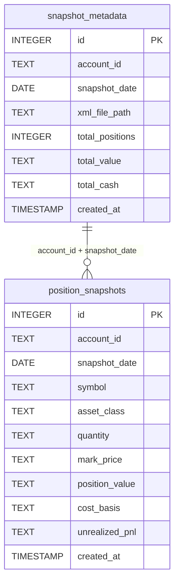

# Database Schema

This document describes the SQLite database schema used by IB Analytics for position history storage.

**Implementation**: `ib_sec_mcp/storage/migrations.py`

## Overview

IB Analytics uses SQLite to persist daily position snapshots for historical analysis. The database consists of two tables:

| Table                | Purpose                                    |
| -------------------- | ------------------------------------------ |
| `position_snapshots` | Daily position data per account per symbol |
| `snapshot_metadata`  | Snapshot-level statistics and audit trail  |

**Database location**: `data/processed/positions.db` (default, configurable via `PositionStore(db_path=...)`)

## Tables

### position_snapshots

Stores individual position records for each snapshot date.

```sql
CREATE TABLE IF NOT EXISTS position_snapshots (
    id INTEGER PRIMARY KEY AUTOINCREMENT,

    -- Composite key for uniqueness
    account_id TEXT NOT NULL,
    snapshot_date DATE NOT NULL,
    symbol TEXT NOT NULL,

    -- Position details
    description TEXT,
    asset_class TEXT NOT NULL,
    cusip TEXT,
    isin TEXT,

    -- Quantities and prices (TEXT for Decimal precision)
    quantity TEXT NOT NULL,
    multiplier TEXT DEFAULT '1',
    mark_price TEXT NOT NULL,
    position_value TEXT NOT NULL,

    -- Cost basis
    average_cost TEXT NOT NULL,
    cost_basis TEXT NOT NULL,

    -- P&L
    unrealized_pnl TEXT DEFAULT '0',
    realized_pnl TEXT DEFAULT '0',

    -- Currency
    currency TEXT DEFAULT 'USD',
    fx_rate_to_base TEXT DEFAULT '1.0',

    -- Bond-specific (nullable)
    coupon_rate TEXT,
    maturity_date DATE,
    ytm TEXT,
    duration TEXT,

    -- Metadata
    created_at TIMESTAMP DEFAULT CURRENT_TIMESTAMP,

    -- Unique constraint to prevent duplicates
    UNIQUE(account_id, snapshot_date, symbol)
);
```

#### Column Details

| Column            | Type      | Nullable | Description                                                 |
| ----------------- | --------- | -------- | ----------------------------------------------------------- |
| `id`              | INTEGER   | No       | Auto-incrementing primary key                               |
| `account_id`      | TEXT      | No       | IB account identifier                                       |
| `snapshot_date`   | DATE      | No       | Date of the position snapshot                               |
| `symbol`          | TEXT      | No       | Trading symbol (e.g., `AAPL`, `US912810SV17`)               |
| `description`     | TEXT      | Yes      | Human-readable position description                         |
| `asset_class`     | TEXT      | No       | Asset class: `STK`, `BOND`, `OPT`, `CASH`, `FUND`           |
| `cusip`           | TEXT      | Yes      | CUSIP identifier (US securities)                            |
| `isin`            | TEXT      | Yes      | ISIN identifier (international)                             |
| `quantity`        | TEXT      | No       | Position quantity (TEXT for Decimal precision)              |
| `multiplier`      | TEXT      | No       | Contract multiplier (default `'1'`)                         |
| `mark_price`      | TEXT      | No       | Market price at snapshot date                               |
| `position_value`  | TEXT      | No       | Total position value (`quantity * mark_price * multiplier`) |
| `average_cost`    | TEXT      | No       | Average cost per unit                                       |
| `cost_basis`      | TEXT      | No       | Total cost basis                                            |
| `unrealized_pnl`  | TEXT      | No       | Unrealized profit/loss (default `'0'`)                      |
| `realized_pnl`    | TEXT      | No       | Realized profit/loss (default `'0'`)                        |
| `currency`        | TEXT      | No       | Position currency (default `'USD'`)                         |
| `fx_rate_to_base` | TEXT      | No       | FX rate to base currency (default `'1.0'`)                  |
| `coupon_rate`     | TEXT      | Yes      | Bond coupon rate (null for non-bonds)                       |
| `maturity_date`   | DATE      | Yes      | Bond maturity date (null for non-bonds)                     |
| `ytm`             | TEXT      | Yes      | Yield to maturity (null for non-bonds)                      |
| `duration`        | TEXT      | Yes      | Bond duration in years (null for non-bonds)                 |
| `created_at`      | TIMESTAMP | No       | Record creation timestamp                                   |

**Why TEXT for financial values**: SQLite stores `REAL` as IEEE 754 floating-point, which introduces rounding errors in financial calculations. By storing values as `TEXT`, we preserve the exact `Decimal` representation and convert back to `Decimal` on read. See `PositionStore.get_position_history()` for the conversion pattern.

### snapshot_metadata

Stores snapshot-level statistics and source file tracking for audit purposes.

```sql
CREATE TABLE IF NOT EXISTS snapshot_metadata (
    id INTEGER PRIMARY KEY AUTOINCREMENT,
    account_id TEXT NOT NULL,
    snapshot_date DATE NOT NULL,

    -- Source tracking
    xml_file_path TEXT NOT NULL,
    date_range_from DATE NOT NULL,
    date_range_to DATE NOT NULL,

    -- Snapshot statistics
    total_positions INTEGER NOT NULL,
    total_value TEXT NOT NULL,
    total_cash TEXT NOT NULL,

    -- Metadata
    created_at TIMESTAMP DEFAULT CURRENT_TIMESTAMP,

    UNIQUE(account_id, snapshot_date)
);
```

#### Column Details

| Column            | Type      | Nullable | Description                              |
| ----------------- | --------- | -------- | ---------------------------------------- |
| `id`              | INTEGER   | No       | Auto-incrementing primary key            |
| `account_id`      | TEXT      | No       | IB account identifier                    |
| `snapshot_date`   | DATE      | No       | Date of the snapshot                     |
| `xml_file_path`   | TEXT      | No       | Source XML file path (audit trail)       |
| `date_range_from` | DATE      | No       | Flex Query date range start              |
| `date_range_to`   | DATE      | No       | Flex Query date range end                |
| `total_positions` | INTEGER   | No       | Number of positions in snapshot          |
| `total_value`     | TEXT      | No       | Total portfolio value (TEXT for Decimal) |
| `total_cash`      | TEXT      | No       | Total cash balance (TEXT for Decimal)    |
| `created_at`      | TIMESTAMP | No       | Record creation timestamp                |

## Indexes

```sql
-- Efficient account + date lookups (most common query pattern)
CREATE INDEX IF NOT EXISTS idx_account_date
ON position_snapshots(account_id, snapshot_date);

-- Symbol history queries
CREATE INDEX IF NOT EXISTS idx_symbol_date
ON position_snapshots(symbol, snapshot_date);

-- Date-only queries (cross-account analysis)
CREATE INDEX IF NOT EXISTS idx_date
ON position_snapshots(snapshot_date);

-- Asset class filtering
CREATE INDEX IF NOT EXISTS idx_asset_class
ON position_snapshots(asset_class);

-- Snapshot metadata lookups
CREATE INDEX IF NOT EXISTS idx_snapshot_account_date
ON snapshot_metadata(account_id, snapshot_date);
```

| Index                       | Table                | Columns                       | Use Case                                            |
| --------------------------- | -------------------- | ----------------------------- | --------------------------------------------------- |
| `idx_account_date`          | `position_snapshots` | `(account_id, snapshot_date)` | Portfolio snapshots for a specific account and date |
| `idx_symbol_date`           | `position_snapshots` | `(symbol, snapshot_date)`     | Position history for a specific symbol over time    |
| `idx_date`                  | `position_snapshots` | `(snapshot_date)`             | Cross-account queries for a specific date           |
| `idx_asset_class`           | `position_snapshots` | `(asset_class)`               | Filtering positions by asset class                  |
| `idx_snapshot_account_date` | `snapshot_metadata`  | `(account_id, snapshot_date)` | Metadata lookups for audit trail                    |

## Migration Procedures

### Schema Creation

**Implementation**: `ib_sec_mcp/storage/migrations.py` - `create_schema()`

Creates both tables and all indexes within a single transaction. Uses `CREATE TABLE IF NOT EXISTS` and `CREATE INDEX IF NOT EXISTS` for idempotency.

```python
from ib_sec_mcp.storage.database import DatabaseConnection
from ib_sec_mcp.storage.migrations import create_schema

db = DatabaseConnection("data/processed/positions.db")
create_schema(db)
```

The schema is automatically created when initializing `PositionStore`:

```python
from ib_sec_mcp.storage.position_store import PositionStore

store = PositionStore()  # Auto-creates schema if not exists
```

### Schema Verification

**Implementation**: `ib_sec_mcp/storage/migrations.py` - `verify_schema()`

Checks that both tables and all expected indexes exist:

```python
from ib_sec_mcp.storage.migrations import verify_schema

is_valid = verify_schema(db)  # Returns True if schema is complete
```

### Schema Deletion

**Implementation**: `ib_sec_mcp/storage/migrations.py` - `drop_schema()`

Drops both tables. Intended for testing purposes only.

```python
from ib_sec_mcp.storage.migrations import drop_schema

drop_schema(db)  # WARNING: Deletes all data
```

## Data Access Patterns

The `PositionStore` class (`ib_sec_mcp/storage/position_store.py`) provides the following operations:

| Method                                                    | Description                                                                                         |
| --------------------------------------------------------- | --------------------------------------------------------------------------------------------------- |
| `save_snapshot(account, date, xml_path)`                  | Save all positions from an Account for a date. Uses `INSERT OR REPLACE` for upsert.                 |
| `get_position_history(account_id, symbol, start, end)`    | Get position history for a symbol over a date range. Returns list of dicts with Decimal conversion. |
| `get_portfolio_snapshot(account_id, date)`                | Get all positions for an account on a specific date. Ordered by position value descending.          |
| `compare_portfolio_snapshots(account_id, date1, date2)`   | Compare portfolio between two dates. Returns added/removed/changed positions with value changes.    |
| `get_position_statistics(account_id, symbol, start, end)` | Get min/max/avg statistics for a position over a date range.                                        |
| `get_available_dates(account_id)`                         | List available snapshot dates for an account. Ordered descending.                                   |

## Data Integrity

- **Deduplication**: `UNIQUE(account_id, snapshot_date, symbol)` prevents duplicate position records. `INSERT OR REPLACE` handles re-imports gracefully.
- **Decimal Precision**: All financial values stored as `TEXT` and converted to `Decimal` on read.
- **Transaction Safety**: All write operations use explicit `BEGIN`/`COMMIT`/`ROLLBACK` transactions.
- **Foreign Keys**: Enabled via `PRAGMA foreign_keys = ON` (though no FK constraints are currently defined between tables).
- **Audit Trail**: `snapshot_metadata.xml_file_path` tracks the source file for each snapshot.

## Entity Relationship



**Note**: The relationship between `snapshot_metadata` and `position_snapshots` is logical (shared `account_id` + `snapshot_date`), not enforced by a foreign key constraint.
